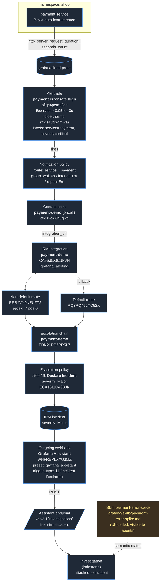

# Demo flow — alert to Investigation

End-to-end wiring for the webinar demo on the `wbkprez` Grafana Cloud stack.
Resource IDs are listed in `PROVISIONED.md`.

Orange node = needs UI/manual setup. Everything else is provisioned via `gcx`
(see `PROVISIONED.md` for the exact commands and resource IDs).
