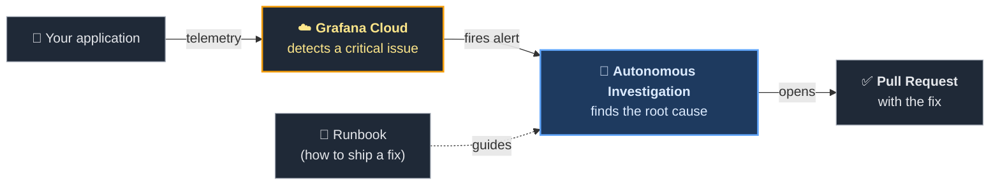
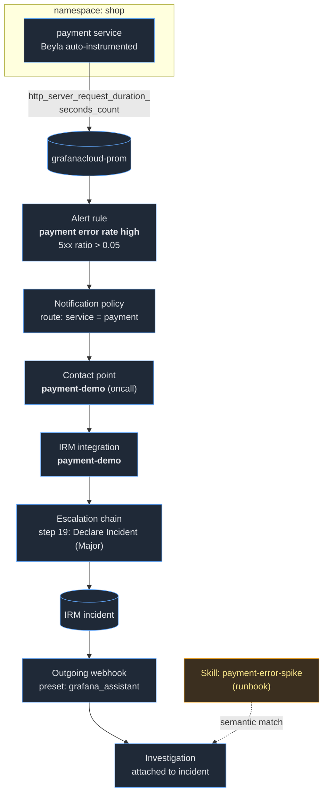

# Demo flow — alert to autonomous fix

The story we tell the customer: **Grafana Cloud detects the critical
issue, kicks off an autonomous Investigation, and the Investigation
follows a runbook that tells it how to ship a fix.**

## How it works in one paragraph

The application sends standard OpenTelemetry signals to Grafana Cloud.
When error rates cross a threshold, Grafana Cloud declares an incident
and launches an autonomous Investigation. The Investigation reads a
short runbook the team authored — describing the service, the repo, and
what a good fix looks like — and uses that guidance to analyse the
telemetry, locate the defect in code, and open a pull request with the
proposed fix. A human reviews and merges.

---

Full technical wiring (for the engineering audience)

Resource IDs and provisioning commands: `PROVISIONED.md`.

